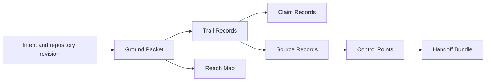

# Groundtrail Method

Groundtrail Method is an original, provider-neutral way to compose evidence-led agent work across a **Change Thread**. It distributes canonical skills, schemas, records, generated provider **Carriers**, and an offline CLI. It does not operate your organization’s workflow.

> **Evidence rule:** a Claim Record can provide context, but never satisfies a Control Point. Only a current Source Record from an authority allowed by the applicable policy can satisfy one.



## What is here

- Eleven canonical, Agent Skills-compatible Groundtrail skills under [`skills/`](skills/).
- Deterministic Carriers for Claude Code, OpenAI Codex, GitHub Copilot, and Devin under [`adapters/`](adapters/).
- JSON Schema v1 contracts, lifecycle catalogs, examples, and an offline validator.
- A local installer that tracks explicit file and block ownership in a target-local `.groundtrail/installation.json` manifest.

Groundtrail is a file and skills distribution layer. It has no server, database, webhook receiver, work queue, policy decision service, credential broker, agent runner, deployment integration, or production control plane. See the full [governance boundary](docs/integration/governance-boundary.md).

## Supported providers

| Provider       | Primary Carrier surface                                | Install mode                                                                        |
| -------------- | ------------------------------------------------------ | ----------------------------------------------------------------------------------- |
| Claude Code    | Plugin payload and project skills                      | Project skills through the CLI; plugin installation through Claude’s native manager |
| OpenAI Codex   | `AGENTS.md` guidance and `.agents/skills/`             | Project                                                                             |
| GitHub Copilot | Repository instructions, agents, and `.github/skills/` | Project                                                                             |
| Devin          | `.agents/skills/`                                      | Project; Knowledge and Playbook exports are manual, optional exports                |

A Carrier may make the canonical contract stricter to fit a provider. It may never enlarge permissions, an Action Band, or evidence authority. Read the provider notes for [Claude Code](docs/providers/claude.md), [Codex](docs/providers/codex.md), [Copilot](docs/providers/copilot.md), and [Devin](docs/providers/devin.md).

## Install choices

Use the package CLI for a target repository, or inspect/render a Carrier yourself. The CLI is offline by default: it does not invoke skills, run a shell, access secret stores, emit telemetry, or make network calls.

```sh
# Inspect the catalog and start with a non-writing plan.
npx @bajrang0789/agentic-sdlc-kit list
npx @bajrang0789/agentic-sdlc-kit install \
  --provider codex --target ../my-repository --dry-run

# After reviewing the plan, install a selected set.
npx @bajrang0789/agentic-sdlc-kit install \
  --provider codex --target ../my-repository \
  --skill repository-discovery --skill intent-framing
```

A dry run may create only the CLI-owned `.groundtrail/` control directory and `install.lock` so it can obtain the same OS-held lock as a real install; it does not write a manifest, journal, staging area, backup, or Carrier file. The installer never adopts or overwrites an unmanaged file. See [safe installation, combinations, updates, and recovery](docs/cli/install.md).

### Five-minute validation

From a clone of this repository with Node.js `>=22 <27`:

```sh
npm ci
npm run build
node dist/cli.js list --json
node dist/cli.js validate ./skills --kind skill
node dist/cli.js validate ./examples
for records in examples/*/records.ndjson; do node dist/cli.js records verify "$records"; done
npm run carriers:check
```

These commands validate canonical skill identity, catalog composition, examples, Trail Record chains, and committed Carrier output without credentials or provider access. For command details, see [CLI installation](docs/cli/install.md), [artifact validation](docs/cli/validate.md), and [record verification](docs/cli/records.md).

## Method at a glance

A Change Thread moves through explicit **Track States**. A **Ground Packet** binds intent and constraints to a repository revision; a **Reach Map** keeps direct, inferred, and unknown impact distinct; and append-only **Trail Records** make decisions and handoffs reviewable. The effective **Action Band** is the most restrictive applicable ceiling.

The canonical lifecycle is:

`unframed → framed → planned → implementing → verifying → assessing → release_ready → releasing → observing → completed`

Material revision changes make revision-bound context, decisions, handoffs, and Source Records stale until they are reevaluated. A Handoff Bundle transfers context; it does not transfer authority or imply approval. Read [the method overview](docs/method/overview.md), [evidence and freshness](docs/method/evidence.md), [Control Points](docs/method/control-points.md), and [composition](docs/method/composition.md).

## Canonical sources and generated Carriers

Author changes in `skills/`, `method/`, and `schemas/` first. `adapters/` is generated output, not an authoring surface. Regenerate after a canonical change:

```sh
npm run carriers:generate
npm run carriers:check
```

Carrier manifests preserve canonical skill digests and payload-tree digests. The tree digest detects changed payload files; it does not establish who trusted or published them. Trail Record chains are likewise tamper-evident, not independently immutable. Durable assurance needs an external trusted checkpoint such as a signed release, CI attestation, transparency-log entry, or governance-system record. Groundtrail can compare a supplied checkpoint but does not operate a checkpoint service.

Schemas have repository-controlled v1 identities and are resolved locally by the CLI. Do not change a published schema’s validation meaning under its existing `$id`; use a new schema identity for an incompatible contract.

## Governance boundary

Groundtrail validates and transports structured records. An external governance system remains authoritative for organizational trust configuration, policy evaluation, lifecycle enforcement, approvals, deployments, production decisions, and checkpoint trust. Groundtrail does not decide that an issuer, agent session, or user assertion is authoritative. See [the governance boundary](docs/integration/governance-boundary.md).

## Contributing and support

Contributions must be independently authored and preserve the evidence rule and canonical-first generation model. Read [CONTRIBUTING.md](CONTRIBUTING.md), [GOVERNANCE.md](GOVERNANCE.md), [SECURITY.md](SECURITY.md), and [SUPPORT.md](SUPPORT.md). The project is Apache-2.0 licensed; see [LICENSE](LICENSE) and [NOTICE](NOTICE).

## Release status

The repository contains prepared release configuration only. It does **not** assert that an npm package, trusted publisher, GitHub ruleset, tag ruleset, release, checksum, SBOM, or attestation has been created. `package.json` supplies the CLI and Carrier-generator version; the prepared release check requires it to agree with the release manifest, skill contracts, Carrier manifests, and release tag. The initial public `0.1.0` release is a manual, scope-owner-only bootstrap; later releases are designed for npm trusted publishing through OIDC, with a tag-based retry path only when npm has not accepted the version. See [the prepared release procedure](docs/releasing.md).
