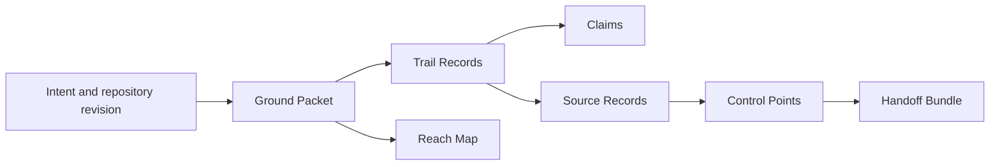

# Groundtrail Method

Groundtrail Method is a provider-neutral, evidence-led method for composing agent work across a Change Thread. It distributes portable records, catalogs, and instructions. It does not operate an organization’s workflow.

A **Change Thread** begins with intended work and advances through the ordered Track States `unframed`, `framed`, `planned`, `implementing`, `verifying`, `assessing`, `release_ready`, `releasing`, `observing`, and `completed`. Side states make interruption explicit rather than silently bypassing it.

```mermaid
stateDiagram-v2
  [*] --> unframed
  unframed --> framed --> planned --> implementing --> verifying --> assessing --> release_ready --> releasing --> observing --> completed
  verifying --> implementing
  assessing --> changes_required
  changes_required --> implementing
  releasing --> release_failed
  release_failed --> planned
  observing --> regressed
  regressed --> rolled_back
  rolled_back --> implementing
  state "needs input" as needs_input
  state "blocked" as blocked
```

Groundtrail carries both assertions and evidence. A Claim Record can explain an observation, proposal, or conclusion. A Source Record is issued by a configured authoritative system. Only a current Source Record permitted by the applicable Control Point can satisfy that Control Point.

Every material artifact identifies its repository and revision. A material revision makes revision-bound packets, decisions, handoffs, and Source Records stale until they are reevaluated. After release, changed work belongs in a new Change Thread linked by `supersedesThreadId`.

## Data flow



The authoritative machine-readable sources are the files in `method/`. Documentation explains those sources; it does not override them.
